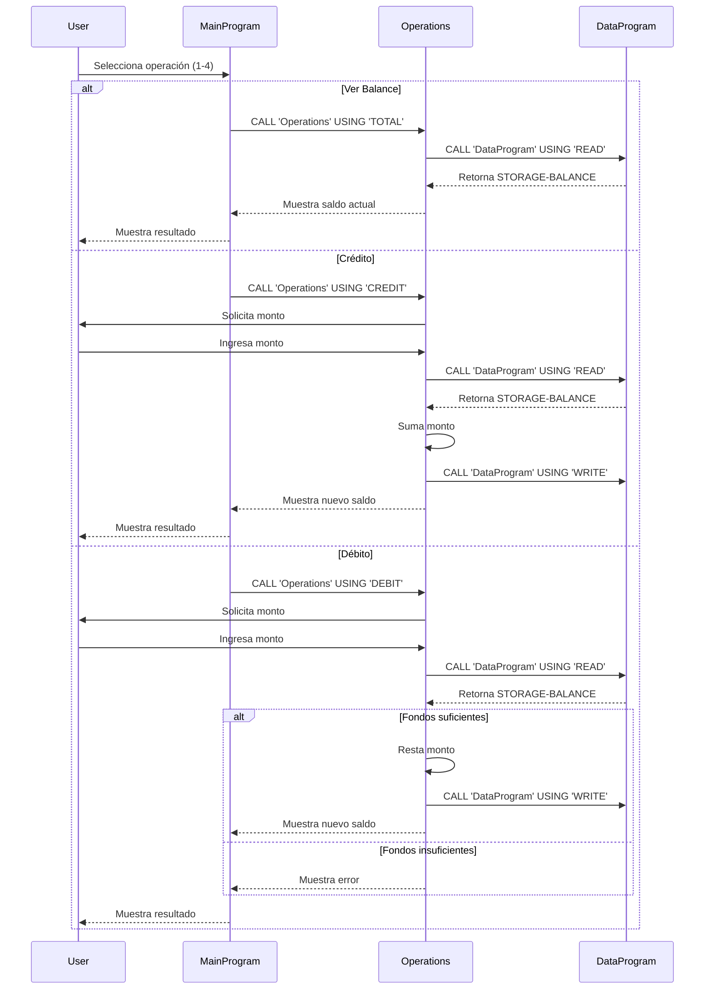

# Documentación del Sistema de Gestión de Cuentas COBOL

## Estructura del Sistema

El sistema está compuesto por tres programas COBOL principales que interactúan entre sí:

### 1. MainProgram (main.cob)

- **Propósito**: Actúa como el punto de entrada principal y la interfaz de usuario del sistema.
- **Funciones Principales**:
  - Muestra el menú principal
  - Maneja la interacción del usuario
  - Dirige las operaciones a través de llamadas al programa Operations
- **Variables Clave**:
  - `USER-CHOICE`: Almacena la selección del usuario (1-4)
  - `CONTINUE-FLAG`: Controla el bucle principal del programa

### 2. Operations (operations.cob)

- **Propósito**: Maneja la lógica de negocio para todas las operaciones de cuenta.
- **Funciones Principales**:
  - Ver saldo (`TOTAL`)
  - Acreditar fondos (`CREDIT`)
  - Debitar fondos (`DEBIT`)
- **Reglas de Negocio**:
  - Verifica fondos suficientes antes de realizar débitos
  - Mantiene el saldo actualizado a través de llamadas a DataProgram
- **Variables Clave**:
  - `AMOUNT`: Cantidad para transacciones de crédito/débito
  - `FINAL-BALANCE`: Almacena temporalmente el saldo de la cuenta

### 3. DataProgram (data.cob)

- **Propósito**: Gestiona el almacenamiento y recuperación de datos del saldo.
- **Funciones Principales**:
  - Lectura del saldo (`READ`)
  - Escritura del saldo (`WRITE`)
- **Variables Clave**:
  - `STORAGE-BALANCE`: Almacena el saldo persistente
  - `BALANCE`: Variable de intercambio para operaciones

## Reglas de Negocio Clave

1. El saldo inicial de la cuenta se establece en 1000.00
2. No se permiten débitos que excedan el saldo disponible
3. Todas las operaciones monetarias utilizan un formato de 6 dígitos enteros y 2 decimales
4. Las operaciones de débito y crédito actualizan inmediatamente el saldo

## Diagrama de Secuencia del Sistema

