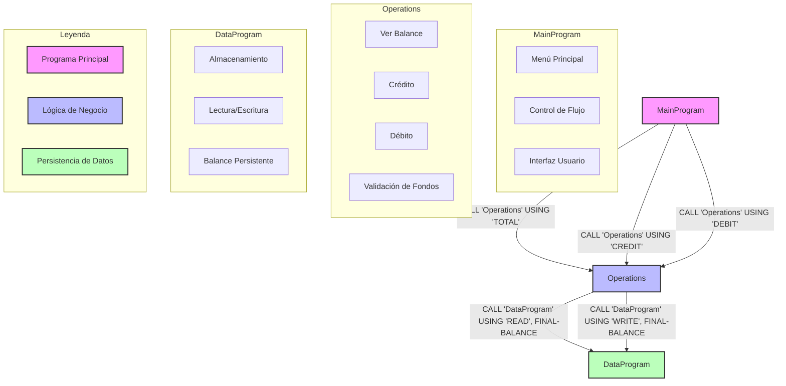

# Diagrama de Relaciones entre Programas COBOL

Este diagrama muestra la estructura orgánica y las relaciones entre los diferentes programas COBOL del sistema.

## Descripción del Diagrama

- **MainProgram (Rosa)**: El punto de entrada del sistema que maneja la interfaz de usuario y el control de flujo principal.
- **Operations (Azul)**: El módulo de lógica de negocio que procesa todas las operaciones de la cuenta.
- **DataProgram (Verde)**: La capa de persistencia que maneja el almacenamiento del balance.

### Flujos de Llamadas

1. **MainProgram -> Operations**:
   - Llama a Operations con 'TOTAL' para consultar el balance
   - Llama a Operations con 'CREDIT' para realizar créditos
   - Llama a Operations con 'DEBIT' para realizar débitos

2. **Operations -> DataProgram**:
   - Llama a DataProgram con 'READ' para obtener el balance actual
   - Llama a DataProgram con 'WRITE' para actualizar el balance

### Responsabilidades

- **MainProgram**: Interfaz de usuario y control de flujo
- **Operations**: Lógica de negocio y validaciones
- **DataProgram**: Persistencia y gestión de datos
